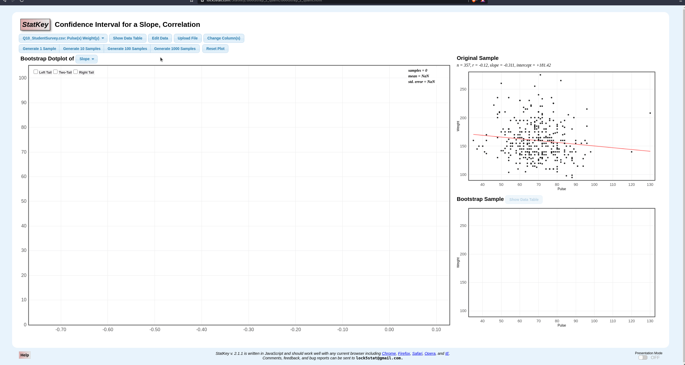

# Clicker

Simple script that uses `PyAutoGUI` to automate StatKey button clicking.

Docs for `PyAutoGUI` found here: https://pyautogui.readthedocs.io/en/latest/index.html


### Set up

```
git clone https://github.com/mlr07/clicker.git
cd clicker
pip3 install pyautogui
```

If you have intallation issues follow instructions for your OS here: https://pyautogui.readthedocs.io/en/latest/install.html

### Usage

With your terminal, navigate to the repo directory and run `python3 clicker.py`. 

If the `generate 1000 samples` button is obscured or minized the script will let you know...

